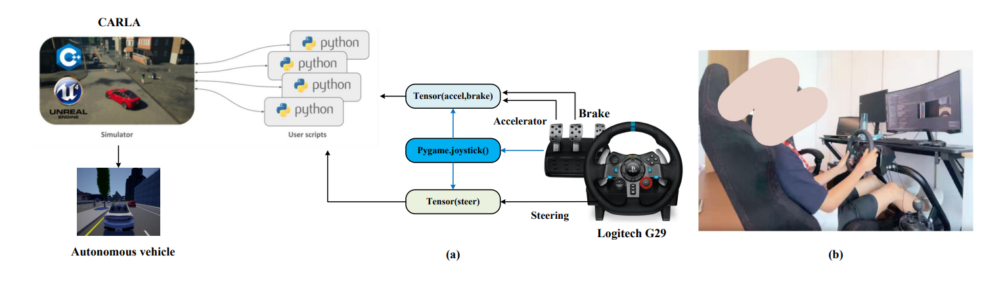

Logitech G29 in CARLA
======

    
 
## The overview of Human expert collects the datasets via the Logitech G29 steering wheel. This repo is part of [Driving-RL-and-Demonstration](https://github.com/Tzj2020/Driving-RL-and-Demonstration) 

## 1.Install CARLA
* Based on Ubuntu 18.04
* Download  [CARLA_0.9.10](https://github.com/carla-simulator/carla/releases)

    `$ export PYTHONPATH=$PYTHONPATH:$YourFolder$/CARLA_0.9.10/PythonAPI/carla/dist/carla-0.9.10-py3.7-linux-x86_64.egg`
    
    `$ cd ~/YourFolder/CARLA_0.9.10/PythonAPI/examples $` and `Add manual_control_steeringwheel_G29.py`
  
    `$ pip install pygame==1.9.6 $`

## 2.Usage
* Enter the CARLA root folder and launch the CARLA server by:

    `$ ./CarlaUE4.sh -opengl -carla-port=2000`
## 3.Install jstest-gtk

* jstest-gtk is a simple joystick testing and configuration tool based on Gtk+. It provides you with an additional list of joysticks, a way to display pressed buttons and axes, a method for remapping axes and buttons, and a method for calibrating the joystick. 

* To install jstest-gtk, use the following command:

     `$ sudo apt-get update $`

     `$ sudo apt-get install jstest-gtk $`

## 4.Build config file: wheel_config.ini
      $ cd ~/YourFolder/CARLA_0.9.10/PythonAPI/examples $

      $ gedit wheel_config.int $

      $ python manual_control_steeringwheel_carla.py $

## 5.PythonAPI via G29
* Please check `Collect_expert_data-via-G29.py`

